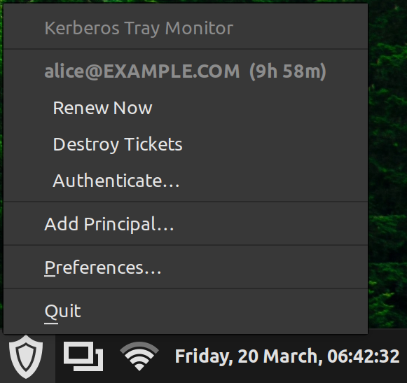

# krbtray

A GTK3 system tray application for Kerberos ticket management on Linux Mint / Cinnamon (and other GTK environments using `GtkStatusIcon`, such as XFCE and MATE).

krbtray sits in your system tray, monitors the state of all Kerberos TGTs in your credential cache collection, automatically renews tickets before they expire, and optionally stores your Kerberos password in the system keyring so it can re-authenticate for you.



## Features

- Tray icon reflects the worst ticket state across all principals
  - `security-high` (green) — all tickets valid
  - `security-medium` (yellow) — at least one ticket is nearing expiry
  - `security-low` (red/grey) — expired or no tickets
- Tooltip lists every principal and its remaining lifetime
- Right-click (or left-click) menu per principal:
  - Renew Now
  - Destroy Tickets
  - Authenticate… (kinit with GTK password dialog)
- Auto-renewal: renews any renewable TGT a configurable number of minutes before expiry; sends a desktop notification if renewal fails
- Password storage via the system Secret Service (GNOME Keyring / KWallet through libsecret)
- Auto-kinit on startup using a stored password
- Multi-principal support via the Heimdal credential cache collection (`KCM:` or `DIR:` recommended)
- Preferences dialog: renewal threshold, check interval, autostart toggle, principal management
- Autostart via XDG `~/.config/autostart/` (standard for Cinnamon and most desktop environments)

## Dependencies

### Runtime

| Library | Package (Debian/Ubuntu/Mint) |
|---|---|
| GTK 3 | `libgtk-3-0` |
| Heimdal Kerberos | `libkrb5-26-heimdal` |
| libsecret | `libsecret-1-0` |
| libnotify | `libnotify4` |

### Build

```bash
sudo apt install \
    cmake \
    pkg-config \
    gettext \
    libgtk-3-dev \
    heimdal-dev \
    libsecret-1-dev \
    libnotify-dev
```

## Building

### Debian package (recommended)

```bash
cmake -B build -DCMAKE_INSTALL_PREFIX=/usr && cmake --build build --target package
sudo dpkg -i build/krbtray-1.1.1-Linux.deb
```

### Manual build with CMake

```bash
cmake -B build -DCMAKE_BUILD_TYPE=Release
cmake --build build
```

To install system-wide (places the binary in `/usr/local/bin` and a `.desktop` file in `/usr/local/share/applications`):

```bash
sudo cmake --install build
```

Or run directly from the build directory:

```bash
./build/krbtray
```

## Configuration

Settings are stored in `~/.config/krbtray/krbtray.conf` (GKeyFile / INI format) and are managed through the **Preferences** dialog. You do not normally need to edit the file by hand.

```ini
[General]
renewal_threshold_mins = 30
check_interval_secs    = 60
autostart              = true

[Principal alice@EXAMPLE.COM]
store_password = true
auto_kinit     = true
```

| Key | Default | Description |
|---|---|---|
| `renewal_threshold_mins` | `30` | Renew a TGT this many minutes before it expires |
| `check_interval_secs` | `60` | How often the app polls the credential cache |
| `autostart` | `false` | Whether to write an XDG autostart entry |
| `store_password` | `false` | Store the principal's password in the keyring |
| `auto_kinit` | `false` | Re-authenticate automatically on startup using the stored password |

## Multi-principal support

Heimdal's `krb5_cccol_cursor` API is used to iterate over all credential caches in the collection. For this to see more than one principal you need a collection-aware ccache type:

```bash
# KCM daemon (recommended — ships with Heimdal):
export KRB5CCNAME=KCM:

# Or directory-based:
export KRB5CCNAME=DIR:~/.cache/krb5/
```

Add the appropriate `KRB5CCNAME` export to `~/.profile` or `/etc/environment` so the setting persists across sessions.

With the default `FILE:` cache only the single default cache is visible, which limits you to one principal.

## Keyring integration

When you authenticate through krbtray and tick **Remember password in keyring**, the password is stored in the system Secret Service under the schema `org.krbtray.Credentials` with a `principal` attribute. You can view or delete it with GNOME Seahorse or `secret-tool`:

```bash
# Look up a stored password
secret-tool lookup principal alice@EXAMPLE.COM

# Delete it
secret-tool clear principal alice@EXAMPLE.COM
```

## Autostart

Enable **Start automatically on login** in Preferences, or manage the file directly:

```bash
# Enable
~/.config/autostart/krbtray.desktop   # created by the app

# Disable — delete the file
rm ~/.config/autostart/krbtray.desktop
```

## Roadmap

- **GTK4 port** — a GTK4 version using `GtkSystemTray` / `libayatana-appindicator` is coming soon.
- **Password changes** — change principal password.

## Credits

Built with the assistance of [Claude](https://claude.ai) (Anthropic).

## License

MIT
